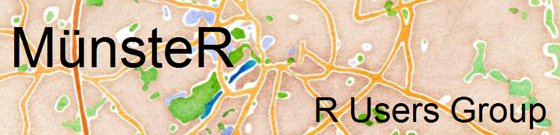

This is to announce that Münster now has its very own R users group!



<br>

If you are from the area, come join us (or if you happen to know someone who is and who might be interested, please forward the info).

You can find us on [meetup.com: https://www.meetup.com/Munster-R-Users-Group/](https://www.meetup.com/Munster-R-Users-Group/) and we are also on the [R User groups list](https://jumpingrivers.github.io/meetingsR/r-user-groups.html).

<br>

Code for the logo, which of course has been created in R:

```{r warning=FALSE, message=FALSE, eval=FALSE}
library(ggplot2)
library(ggmap)
library(ggthemes)

munster <- get_map(location = 'Munster', zoom = 12, maptype = "watercolor")
ggmap(munster) +
  scale_y_continuous(limits=c(51.94, 51.97)) +
  annotate("text", x=7.565, y=51.96, label= "MünsteR", size = 8) +
  annotate("text", x=7.685, y=51.945, label= "R Users Group", size = 5) +
  theme_map()
ggsave("r_user_group_logo.pdf")
```
