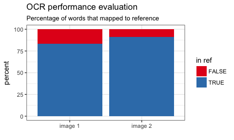

One of the many great packages of rOpenSci has implemented [the open source engine Tesseract](https://ropensci.org/blog/blog/2016/11/16/tesseract).

Optical character recognition (OCR) is used to digitize written or typed documents, i.e. photos or scans of text documents are "translated" into a digital text on your computer.

While this might seem like a trivial task at first glance, because it is so easy for our human brains. When reading text, we make use of our built-in word and sentence "autocomplete" that we learned from experience. But the same task is really quite difficult for a computer to recognize typed words correctly, especially if the document is of low quality.

One of the best open-source engines today is [Tesseract](https://github.com/tesseract-ocr). You can run tesseract from the command-line or - with the help of rOpenSci's **tesseract** package - run it conveniently from within R!

Tesseract uses language specific training data to optimize OCR based on learned context. Therefore, it is much better at recognizing words in coherent sentences than at recognizing single words or abbreviations (we can see this e.g. with address lines in documents).

The default language is English, and you can find numerous examples on how to run OCR with this default. But running tesseract with a different language turned out to need a few additional tweaks, which I want to present here.

<br>

Installing tesseract
--------------------

Check out the [package vignette](https://ropensci.org/blog/blog/2016/11/16/tesseract) for instructions on how to install the libtesseract C++ library and the **tesseract** R package on your computer.

``` r
library(tesseract)
```

Because I'm German and will therefore use a German scanned document as an example, I first needed to install the German training dataset. Even though I installed it together with tesseract (the command-line tool), I still had to install it again for use with R:

If you happen to get an error, that it still didn't find the correct language data where it expected (as I did), note the path that is given in the error message. This tells you where it looks for the training data and you can simply download the training data manually and copy it to the given path.

Here again, you need to make sure that you download training data for the correct version of tesseract. The [link that is given in the package documentation](https://github.com/tesseract-ocr/tessdata) turned out to point to a different version of tesseract than I was using. If this is the case, you will get a warning (*Params model::Incomplete line*) when running `ocr`().

As you can see, I had Tesseract version 3 installed:

    system("tesseract --version")
    tesseract 3.05.01
     leptonica-1.74.1
      libjpeg 8d : libpng 1.6.29 : libtiff 4.0.8 : zlib 1.2.8

So, I also needed to download the training data for version 3 (the default is for version 4), which you can [find here](https://github.com/tesseract-ocr/tessdata/tree/3.04.00) and copy it to tesseracts language folder.

<br>

Image processing
----------------

Image quality is essential for good OCR! Tesseract performs different image processing steps internally with the Leptonica library but it is still a good idea to [improve the image manually before running tesseract](https://github.com/tesseract-ocr/tesseract/wiki/ImproveQuality).

Here, I am using two random images from the internet:

1.  a [manual for a printer](http://www.manualsdir.eu/manuals/375646/brother-dcp-115c-dcp-120c-mfc-820cw-mfc-640cw-mfc-215c-dcp-315cn-mfc-425cn-dcp-340cw.html) and

2.  a [description of a game](http://spiele.j-crew.de/wiki/Scan:9q_r%C3%A4t.pdf/4)

Image nr. 1 is machine-generated and should therefore yield much better results than image nr. 2, which looks like it was typewriter-written and moreover, is skewed.

This, we can also do from within R, making use of another one of rOpenSci's packages: [**magick**](https://cran.r-project.org/web/packages/magick/vignettes/intro.html).

However, it seems that **magick** doesn't have a function that converts an image to black and white, so I am using **EBImage** first. Because **magick** wants an magick image object for input, I saved the black-and-white image first and then read it in again with `image_read()`. This isn't exactly an elegant solution, so if someone knows of a better way to do this, please let me know!

``` r
library(EBImage) # install from Bioconductor!
```

``` r
color.image <- readImage("/Users/shiringlander/Documents/Github/Blog_posts_prep/ocr/beispiel_scan.png")
bw.image <- channel(color.image,"gray")
writeImage(bw.image,file="/Users/shiringlander/Documents/Github/Blog_posts_prep/ocr/beispiel_scan_bw.png")
```

``` r
color.image <- readImage("/Users/shiringlander/Documents/Github/Blog_posts_prep/ocr/beispiel_scan_2.jpg")
bw.image <- channel(color.image,"gray")
writeImage(bw.image,file="/Users/shiringlander/Documents/Github/Blog_posts_prep/ocr/beispiel_scan_2_bw.jpg")
```

``` r
library(magick)
image1 <- image_read("/Users/shiringlander/Documents/Github/Blog_posts_prep/ocr/beispiel_scan_bw.png")
image2 <- image_read("/Users/shiringlander/Documents/Github/Blog_posts_prep/ocr/beispiel_scan_2_bw.jpg")
```

Now, we can follow [Tesseract's guidelines on how to improve image quality](https://github.com/tesseract-ocr/tesseract/wiki/ImproveQuality):

``` r
library(tidyverse)
```

``` r
image_bearb1 <- image1 %>%
    image_scale("x2000") %>%                        # rescale
    image_background("white", flatten = TRUE) %>%   # set background to white
    image_trim() %>%                                # Trim edges that are the background color from the image.
    image_noise() %>%                               # Reduce noise in image using a noise peak elimination filter
    image_enhance() %>%                             # Enhance image (minimize noise)
    image_normalize() %>%                           # Normalize image (increase contrast by normalizing the pixel values to span the full range of color values).
    image_contrast(sharpen = 1) %>%                 # increase contrast
    image_deskew(treshold = 40)                     # deskew image -> creates negative offset in some scans
```

``` r
image_bearb2 <- image2 %>%
    image_scale("x2000") %>%                        # rescale
    image_background("white", flatten = TRUE) %>%   # set background to white
    image_trim() %>%                                # Trim edges that are the background color from the image.
    image_noise() %>%                               # Reduce noise in image using a noise peak elimination filter
    image_enhance() %>%                             # Enhance image (minimize noise)
    image_normalize() %>%                           # Normalize image (increase contrast by normalizing the pixel values to span the full range of color values).
    image_contrast(sharpen = 1) %>%                 # increase contrast
    image_deskew(treshold = 40)                     # deskew image -> creates negative offset in some scans
```

If we want to inspect our images from within R, we can use **magick**'s `image_browse()` function.

``` r
image_browse(image_bearb2)
```

<br>

OCR
---

Tesseract's central function is called `ocr()`.

For some reason, I couldn't solve the error message I got when directly pointing the processed images to the `ocr()` function: `Magick: TIFF: negative image positions unsupported`. This error results from `image_deskew()` but all potential solutions don't seem to be implemented with the R package of ImageMagick, so I had to resort to a work-around: I saved the images first and then pointed `ocr()` to the images. This worked without a hitch!

``` r
image_write(image_bearb1, path = "/Users/shiringlander/Documents/Github/Blog_posts_prep/ocr/beispiel_scan_bearb.png", format = "png")
image_write(image_bearb2, path = "/Users/shiringlander/Documents/Github/Blog_posts_prep/ocr/beispiel_scan_2_bearb.jpg", format = "jpg")
```

When we are not working with an English document, we can specify the language with the `engine = tesseract(language = "deu")` option. We can also set a whole [range of parameters](http://www.sk-spell.sk.cx/tesseract-ocr-parameters-in-302-version) but for now, I will only show how to use a whitelist: by specifying characters in a whitelist, tesseract will only look for these in the document. You can e.g. use this if you only expect numbers in you document. Here I am not being very restrictive, though...

``` r
whitelist <- "1234567890-.,;:qwertzuiopüasdfghjklöäyxcvbnmQWERTZUIOPÜASDFGHJKLÖÄYXCVBNM@߀!$%&/()=?+"

text1 <- ocr("/Users/shiringlander/Documents/Github/Blog_posts_prep/ocr/beispiel_scan_bearb.png",
             engine = tesseract(language = "deu",
                                options = list(tessedit_char_whitelist = whitelist)))

text2 <- ocr("/Users/shiringlander/Documents/Github/Blog_posts_prep/ocr/beispiel_scan_2_bearb.jpg",
             engine = tesseract(language = "deu",
                                options = list(tessedit_char_whitelist = whitelist)))
```

<br>

Performance evaluation
----------------------

Evaluating how good our model performed isn't trivial either. While we as humans can very easily judge the accuracy of our digitzed text just by looking at it, we need a standardized and automated way to evaluate model performance.

One way would be to manually transcribe your document and check it against the text that tesseract extracted. However, this is very labor-intensive and time-consuming, especially when you're working with a large number of documents!

Another, slightly less arduous way would be to create a list of relevant words that we want to have recognized. This could be adapted to include any list of given words that are important for you to be recognized (if you wanted to be able to search for them among your documents, for example).

Or, as I am going to do here, we can go a much easier way and compare the words that tesseract recognized to a list of words from a dictionary to get an idea about how many of them are actual words. This is of course not without problems: Some words may not be in our dictionary or they are borrowed from another language, they might be names of people or places, addresses, abbreviations, etc. Also, because we don't have a benchmark for our document, we will only get an estimation of how many words were correctly recognized. But we can really only compare different tesseract models against each other with this method.

Because we use different grammatical forms of words, we also want to stem both our recognized words and the dictionary before comparing them!

Here, I am using the [German Open Thesaurus](https://www.openthesaurus.de/about/download).

To separate the text and the dictionary into distinct words, I am using the **tidytext** package together with **SnowballC** for word stemming. Finally, I am going to remove duplicate entries.

``` r
library(tidytext)
library(SnowballC)

openthes <- data.frame(words = read_lines("/Users/shiringlander/Documents/Projekte/OCR_Provinzial/German_dict/OpenThesaurus-Textversion/openthesaurus.txt", skip = 18)) %>%
  mutate(words = as.character(words)) %>%
  unnest_tokens(word, words) %>%
  mutate(word = wordStem(word, language = "deu")) %>%
  distinct()
```

This leaves us with 77453 German reference words.

Now, we can do the same with our tesseract output.

``` r
text_1_df <- data.frame(text = read.delim(textConnection(text1),    # make text into dataframe
                                          header = FALSE, 
                                          sep = "\n", 
                                          strip.white = TRUE)) %>%
  mutate(text = as.character(V1)) %>%
  unnest_tokens(word, text) %>%                                      # separate words
  mutate(word = wordStem(word, language = "deu"))                    # use word stem

text_2_df <- data.frame(text = read.delim(textConnection(text2),    # make text into dataframe
                                          header = FALSE, 
                                          sep = "\n", 
                                          strip.white = TRUE)) %>%
  mutate(text = as.character(V1)) %>%
  unnest_tokens(word, text) %>%                                      # separate words
  mutate(word = wordStem(word, language = "deu"))                    # use word stem
```

To get an estimate about model performance, I am then counting how many of the words that were recognized in each document are also part of the German dictionary (and therefore likely to be real words) and plot the results.

``` r
res1 <- text_1_df %>%
    mutate(in_dict = ifelse(word %in% openthes$word, TRUE, FALSE)) %>%
    count(in_dict) %>%
    mutate(percent = n / nrow(text_1_df) * 100,
           image = "image 1")

res2 <- text_2_df %>%
    mutate(in_dict = ifelse(word %in% openthes$word, TRUE, FALSE)) %>%
    count(in_dict) %>%
    mutate(percent = n / nrow(text_2_df) * 100,
           image = "image 2")
```



Between 80 and 90% of recognized words seem to be actual words!

Of course, the less "standard" a document is, the more difficult it will be to extract text correctly but I'd say this isn't bad for a first attempt!

------------------------------------------------------------------------

<br>

``` r
sessionInfo()
```

    ## R version 3.4.0 (2017-04-21)
    ## Platform: x86_64-apple-darwin15.6.0 (64-bit)
    ## Running under: macOS Sierra 10.12.5
    ## 
    ## Matrix products: default
    ## BLAS: /Library/Frameworks/R.framework/Versions/3.4/Resources/lib/libRblas.0.dylib
    ## LAPACK: /Library/Frameworks/R.framework/Versions/3.4/Resources/lib/libRlapack.dylib
    ## 
    ## locale:
    ## [1] de_DE.UTF-8/de_DE.UTF-8/de_DE.UTF-8/C/de_DE.UTF-8/de_DE.UTF-8
    ## 
    ## attached base packages:
    ## [1] stats     graphics  grDevices utils     datasets  methods   base     
    ## 
    ## other attached packages:
    ##  [1] bindrcpp_0.2    SnowballC_0.5.1 tidytext_0.1.3  dplyr_0.7.1    
    ##  [5] purrr_0.2.2.2   readr_1.1.1     tidyr_0.6.3     tibble_1.3.3   
    ##  [9] ggplot2_2.2.1   tidyverse_1.1.1 magick_0.4      EBImage_4.18.0 
    ## [13] tesseract_1.4  
    ## 
    ## loaded via a namespace (and not attached):
    ##  [1] locfit_1.5-9.1      reshape2_1.4.2      haven_1.1.0        
    ##  [4] lattice_0.20-35     colorspace_1.3-2    htmltools_0.3.6    
    ##  [7] yaml_2.1.14         rlang_0.1.1         foreign_0.8-69     
    ## [10] glue_1.1.1          RColorBrewer_1.1-2  BiocGenerics_0.22.0
    ## [13] modelr_0.1.0        readxl_1.0.0        jpeg_0.1-8         
    ## [16] bindr_0.1           plyr_1.8.4          stringr_1.2.0      
    ## [19] cellranger_1.1.0    munsell_0.4.3       gtable_0.2.0       
    ## [22] rvest_0.3.2         psych_1.7.5         evaluate_0.10.1    
    ## [25] labeling_0.3        knitr_1.16          forcats_0.2.0      
    ## [28] parallel_3.4.0      tokenizers_0.1.4    broom_0.4.2        
    ## [31] Rcpp_0.12.11        backports_1.1.0     scales_0.4.1       
    ## [34] jsonlite_1.5        abind_1.4-5         mnormt_1.5-5       
    ## [37] hms_0.3             png_0.1-7           digest_0.6.12      
    ## [40] stringi_1.1.5       tiff_0.1-5          grid_3.4.0         
    ## [43] rprojroot_1.2       tools_3.4.0         magrittr_1.5       
    ## [46] lazyeval_0.2.0      janeaustenr_0.1.5   pkgconfig_2.0.1    
    ## [49] Matrix_1.2-10       xml2_1.1.1          lubridate_1.6.0    
    ## [52] assertthat_0.2.0    rmarkdown_1.6       httr_1.2.1         
    ## [55] R6_2.2.2            fftwtools_0.9-8     nlme_3.1-131       
    ## [58] compiler_3.4.0
