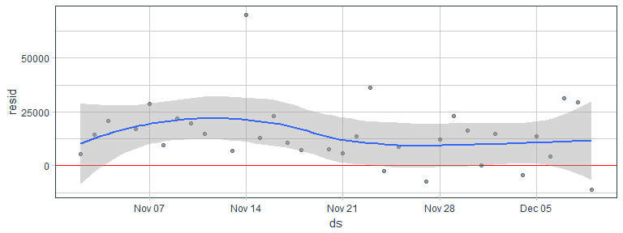
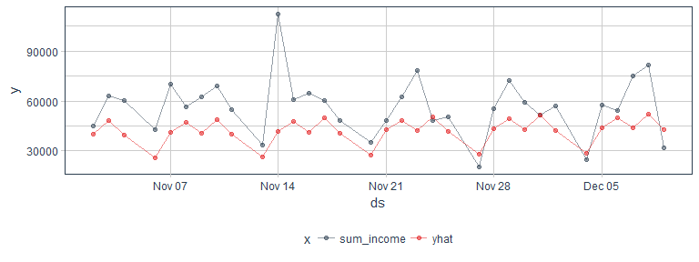
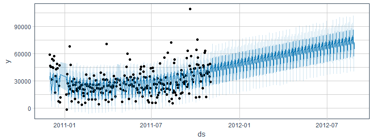

In my last two posts ([Part 1](https://shiring.github.io/forecasting/2017/05/28/retail_forcasting_part1) and [Part 2](https://shiring.github.io/forecasting/2017/06/09/retail_forcasting_part2)), I explored time series forecasting with the **timekit** package.

In this post, I want to compare how [Facebook's prophet](https://facebookincubator.github.io/prophet/) performs on the same dataset.

<br>

Predicting future events/sales/etc. isn't trivial for a number of reasons and different algorithms use different approaches to handle these problems. Time series data does not behave like a regular numeric vector, because months don't have the same number of days, weekends and holidays differ between years, etc. Because of this, we often have to deal with multiple layers of seasonality (i.e. weekly, monthly, yearly, irregular holidays, etc.). Regularly missing days, like weekends, are easier to incorporate into time series models than irregularly missing days.

<br>

**Timekit** uses a time series signature for modeling, which we used as features to build our model of choice (e.g. a linear model). This model was then used for predicting future dates.

**Prophet** is Facebook's time series forecasting algorithm that was just recently released as open source software with an implementation in R.

> "[Prophet](https://facebookincubator.github.io/prophet/) is a procedure for forecasting time series data. It is based on an additive model where non-linear trends are fit with yearly and weekly seasonality, plus holidays. It works best with daily periodicity data with at least one year of historical data. Prophet is robust to missing data, shifts in the trend, and large outliers."

(I am not going to discuss **forecast** and ARIMA or other models because they are quite well established with lots and lots of excellent tutorials out there.)

<br>

### Training and Test data

I am using the same training and test intervals as in [my last post using **timekit**](https://shiring.github.io/forecasting/2017/06/09/retail_forcasting_part2).

Just as with **timekit**, **prophet** starts with a data frame that consists of a date column and the respective response variable for each date.

``` r
library(prophet)

library(tidyverse)
library(tidyquant)
```

``` r
retail_p_day <- retail_p_day %>%
  mutate(model = ifelse(day <= "2011-11-01", "train", "test"))

train <- filter(retail_p_day, model == "train") %>%
  select(day, sum_income) %>%
  rename(ds = day,
         y = sum_income)

test <- filter(retail_p_day, model == "test") %>%
  select(day, sum_income) %>%
  rename(ds = day)
```

<br>

### Model building

In contrast to **timekit**, we do not "manually" augment the time series signature in **prophet**, we can directly feed our input data to the `prophet()` function (check the function help for details on optional parameters).

To make it comparable, I am feeding the same list of irregularly missing days to the `prophet()` function. As discussed in the last post, I chose not use a list of actual holidays because the holidays in the observation period poorly matched the days that were actually missing.

``` r
off_days <- data.frame(ds = as.Date(c("2010-12-24", "2010-12-25", "2010-12-26", "2010-12-27", "2010-12-28", 
                                      "2010-12-29", "2010-12-30", "2010-01-01", "2010-01-02", "2010-01-03",
                                      "2011-04-22", "2011-04-23", "2011-04-24", "2011-04-25", "2011-05-02", 
                                      "2011-05-30", "2011-08-29", "2011-04-29", "2011-04-30"))) %>%
  mutate(holiday = paste0("off_day_", seq_along(1:length(ds))))
```

``` r
prophet_model_test <- prophet(train, 
                              growth = "linear", # growth curve trend
                              n.changepoints = 100, # Prophet automatically detects changes in trends by selecting changepoints from the data
                              yearly.seasonality = FALSE, # yearly seasonal component using Fourier series
                              weekly.seasonality = TRUE, # weekly seasonal component using dummy variables
                              holidays = off_days) 
```

    ## Initial log joint probability = -8.3297
    ## Optimization terminated normally: 
    ##   Convergence detected: relative gradient magnitude is below tolerance

<br>

### Predicting test data

With our model, we can now predict on the test data and compare the predictions with the actual values.

``` r
forecast_test <- predict(prophet_model_test, test)
```

<br>

Just as with **timekit**, I want to have a look at the residuals. Compared to **timekit**, the residuals actually look almost identical...

``` r
forecast_test %>%
  mutate(resid = sum_income - yhat) %>%
  ggplot(aes(x = ds, y = resid)) +
    geom_hline(yintercept = 0, color = "red") +
    geom_point(alpha = 0.5, color = palette_light()[[1]]) +
    geom_smooth() +
    theme_tq()
```



<br>

... As does the comparison plot. So, here it seems that **prophet** built a model that is basically identical to the linear model I used with **timekit**.

``` r
forecast_test %>%
  gather(x, y, sum_income, yhat) %>%
  ggplot(aes(x = ds, y = y, color = x)) +
    geom_point(alpha = 0.5) +
    geom_line(alpha = 0.5) +
    scale_color_manual(values = palette_light()) +
    theme_tq()
```



<br>

### Predicting future sales

Now, let's see whether the future predictions will be identical as well.

And just like with **timekit**, I am using a future time series of 300 days. Here, we however see a slight difference to how we generate the future time series: with **timekit** I could use the entire index of observed dates, together with the list of missing days, while **prophet** uses the forecasting model that was generated for comparing the test data. We could built a new model with the entire dataset but this would then be different to how I approached the modeling with **timekit**.

``` r
future <- make_future_dataframe(prophet_model_test, periods = 300)
```

``` r
forecast <- predict(prophet_model_test, future)
```

``` r
plot(prophet_model_test, forecast) +
    theme_tq()
```



Interestingly, **prophet**'s forecast is distinctly different from **timekit**'s, despite identical performance on test samples! While **timekit** predicted a drop at the beginning of the year (similar to the training period), **prophet** predicts a steady increase in the future. It looks like **timekit** put more weight on the overall pattern during the training period, while **prophet** seems to put more weight on the last months, that showed a rise in net income.

------------------------------------------------------------------------

<br>

``` r
sessionInfo()
```

    ## R version 3.4.0 (2017-04-21)
    ## Platform: x86_64-w64-mingw32/x64 (64-bit)
    ## Running under: Windows 7 x64 (build 7601) Service Pack 1
    ## 
    ## Matrix products: default
    ## 
    ## locale:
    ## [1] LC_COLLATE=English_United States.1252 
    ## [2] LC_CTYPE=English_United States.1252   
    ## [3] LC_MONETARY=English_United States.1252
    ## [4] LC_NUMERIC=C                          
    ## [5] LC_TIME=English_United States.1252    
    ## 
    ## attached base packages:
    ## [1] stats     graphics  grDevices utils     datasets  methods   base     
    ## 
    ## other attached packages:
    ##  [1] tidyquant_0.5.1               quantmod_0.4-8               
    ##  [3] TTR_0.23-1                    PerformanceAnalytics_1.4.3541
    ##  [5] xts_0.9-7                     zoo_1.8-0                    
    ##  [7] lubridate_1.6.0               dplyr_0.5.0                  
    ##  [9] purrr_0.2.2.2                 readr_1.1.1                  
    ## [11] tidyr_0.6.3                   tibble_1.3.1                 
    ## [13] ggplot2_2.2.1                 tidyverse_1.1.1              
    ## [15] prophet_0.1.1                 Rcpp_0.12.11                 
    ## 
    ## loaded via a namespace (and not attached):
    ##  [1] rstan_2.15.1         reshape2_1.4.2       haven_1.0.0         
    ##  [4] lattice_0.20-35      colorspace_1.3-2     htmltools_0.3.6     
    ##  [7] stats4_3.4.0         yaml_2.1.14          rlang_0.1.1         
    ## [10] foreign_0.8-68       DBI_0.6-1            modelr_0.1.0        
    ## [13] readxl_1.0.0         plyr_1.8.4           stringr_1.2.0       
    ## [16] Quandl_2.8.0         munsell_0.4.3        gtable_0.2.0        
    ## [19] cellranger_1.1.0     rvest_0.3.2          codetools_0.2-15    
    ## [22] psych_1.7.5          evaluate_0.10        labeling_0.3        
    ## [25] inline_0.3.14        knitr_1.16           forcats_0.2.0       
    ## [28] parallel_3.4.0       broom_0.4.2          scales_0.4.1        
    ## [31] backports_1.0.5      StanHeaders_2.15.0-1 jsonlite_1.5        
    ## [34] gridExtra_2.2.1      mnormt_1.5-5         hms_0.3             
    ## [37] digest_0.6.12        stringi_1.1.5        grid_3.4.0          
    ## [40] rprojroot_1.2        tools_3.4.0          magrittr_1.5        
    ## [43] lazyeval_0.2.0       xml2_1.1.1           extraDistr_1.8.5    
    ## [46] assertthat_0.2.0     rmarkdown_1.5        httr_1.2.1          
    ## [49] R6_2.2.1             nlme_3.1-131         compiler_3.4.0
