Resources I found useful for this analysis were <http://www.rdatamining.com/docs/twitter-analysis-with-r> and <http://tidytextmining.com/tidytext.html>

Retrieving Twitter data
-----------------------

I am using **twitteR** to retrieve data from Twitter.

``` r
library(twitteR)
```

Btw: I have also tried **rtweet** but for some reason, my API key, secret and token (that worked with **twitteR**) resulted in a "failed to authorize" error with **rtweet**'s functions.

<br>

Once we have [set up our Twitter REST API](https://dev.twitter.com/rest/public), we get the necessary information to authenticate our access.

``` r
consumerKey = "INSERT KEY HERE"
consumerSecret = "INSERT SECRET KEY HERE"
accessToken = "INSERT TOKEN HERE"
accessSecret = "INSERT SECRET TOKEN HERE"
```

``` r
options(httr_oauth_cache = TRUE)

setup_twitter_oauth(consumer_key = consumerKey, 
                    consumer_secret = consumerSecret, 
                    access_token = accessToken, 
                    access_secret = accessSecret)
```

Now, we can access information from Twitter, like timeline tweets, user timelines, mentions, tweets & retweets, followers, etc.

All the following datasets were retrieved on June 7th 2017, converted to a dataframe for tidy analysis and saved for later use:

-   the last 3200 tweets on my timeline

``` r
my_name <- userTimeline("ShirinGlander", n = 3200, includeRts=TRUE)
my_name_df <- twListToDF(my_name)
save(my_name_df, file = "my_name.RData")
```

-   my last 3200 mentions and retweets

``` r
my_mentions <- mentions(n = 3200)
my_mentions_df <- twListToDF(my_mentions)
save(my_mentions_df, file = "my_mentions.RData")

my_retweets <- retweetsOfMe(n = 3200)
my_retweets_df <- twListToDF(my_retweets)
save(my_retweets_df, file = "my_retweets.RData")
```

-   the last 3200 tweets to me

``` r
tweetstome <- searchTwitter("@ShirinGlander", n = 3200)
tweetstome_df <- twListToDF(tweetstome)
save(tweetstome_df, file = "tweetstome.RData")
```

-   my friends and followers

``` r
user <- getUser("ShirinGlander")

friends <- user$getFriends() # who I follow
friends_df <- twListToDF(friends)
save(friends_df, file = "my_friends.RData")

followers <- user$getFollowers() # my followers
followers_df <- twListToDF(followers)
save(followers_df, file = "my_followers.RData")
```

<br>

Analysing my friends and followers
----------------------------------

For today, I will characterise my friends and followers.

``` r
load("my_friends.RData")
load("my_followers.RData")
```

I am goint to use packages from the **tidyverse** (**tidyquant** for plotting).

``` r
library(tidyverse)
library(tidyquant)
```

-   Number of friends (who I follow on Twitter): 225

-   Number of followers (who follows me on Twitter): 324

-   Number of friends who are also followers: 97

<br>

### What languages do my followers speak?

One of the columns describing my followers is which language they have set for their Twitter account. Not surprisingly, English is by far the most predominant language of my followers, followed by German, Spanish and French.

``` r
followers_df %>%
  count(lang) %>%
  droplevels() %>%
  ggplot(aes(x = reorder(lang, desc(n)), y = n)) +
    geom_bar(stat = "identity", color = palette_light()[1], fill = palette_light()[1], alpha = 0.8) +
    theme_tq() +
    theme(axis.text.x = element_text(angle = 45, vjust = 1, hjust = 1)) +
    labs(x = "language ISO 639-1 code",
         y = "number of followers")
```

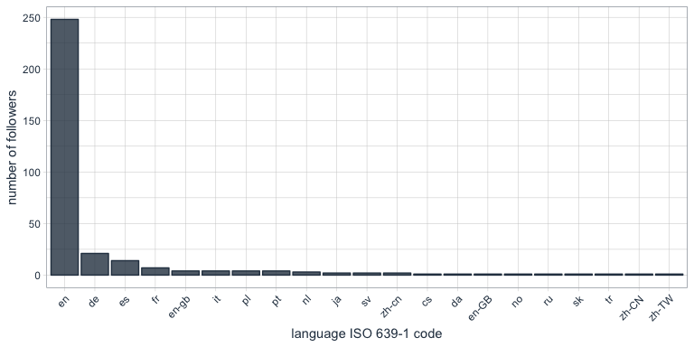

<br>

### Who are my most "influential" followers (i.e. followers with the biggest network)?

I also have information about the number of followers that each of my followers have (2nd degree followers) Most of my followers is followed by up to ~ 1000 people, while only a few have a very large network.

``` r
followers_df %>%
  ggplot(aes(x = log2(followersCount))) +
    geom_density(color = palette_light()[1], fill = palette_light()[1], alpha = 0.8) +
    theme_tq() +
    labs(x = "log2 of number of followers",
         y = "density")
```

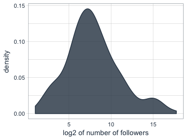

<br>

### How active are my followers (i.e. how often do they tweet)

The followers dataframe also tells me how many statuses [(i.e. tweets)](https://dev.twitter.com/rest/reference/get/statuses/user_timeline) each of followers have. To make the numbers comparable, I am normalising them by the number of days that they have had their accounts to calculate the average number of tweets per day.

``` r
followers_df %>%
  mutate(date = as.Date(created, format = "%Y-%m-%d"),
         today = as.Date("2017-06-07", format = "%Y-%m-%d"),
         days = as.numeric(today - date),
         statusesCount_pDay = statusesCount / days) %>%
  ggplot(aes(x = log2(statusesCount_pDay))) +
    geom_density(color = palette_light()[1], fill = palette_light()[1], alpha = 0.8) +
    theme_tq() +
    labs(x = "log2 of average nr. of tweets per day")
```

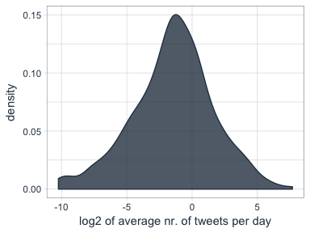

<br>

Who are my followers with the biggest network and who tweet the most?

``` r
followers_df %>%
  mutate(date = as.Date(created, format = "%Y-%m-%d"),
         today = as.Date("2017-06-07", format = "%Y-%m-%d"),
         days = as.numeric(today - date),
         statusesCount_pDay = statusesCount / days) %>%
  select(screenName, followersCount, statusesCount_pDay) %>%
  arrange(desc(followersCount)) %>%
  top_n(10)
```

    ##         screenName followersCount statusesCount_pDay
    ## 1        dr_morton         150937           71.35193
    ## 2    Scientists4EU          66117           17.64389
    ## 3       dr_morton_          63467           46.57763
    ## 4   NewScienceWrld          60092           54.65874
    ## 5     RubenRabines          42286           25.99592
    ## 6  machinelearnbot          27427          204.67061
    ## 7  BecomingDataSci          16807           25.24069
    ## 8       joelgombin           6566           21.24094
    ## 9    renato_umeton           1998           19.58387
    ## 10 FranPatogenLoco            311           28.92593

``` r
followers_df %>%
  mutate(date = as.Date(created, format = "%Y-%m-%d"),
         today = as.Date("2017-06-07", format = "%Y-%m-%d"),
         days = as.numeric(today - date),
         statusesCount_pDay = statusesCount / days) %>%
  select(screenName, followersCount, statusesCount_pDay) %>%
  arrange(desc(statusesCount_pDay)) %>%
  top_n(10)
```

    ##         screenName followersCount statusesCount_pDay
    ## 1  machinelearnbot          27427          204.67061
    ## 2        dr_morton         150937           71.35193
    ## 3   NewScienceWrld          60092           54.65874
    ## 4       dr_morton_          63467           46.57763
    ## 5  FranPatogenLoco            311           28.92593
    ## 6     RubenRabines          42286           25.99592
    ## 7  BecomingDataSci          16807           25.24069
    ## 8       joelgombin           6566           21.24094
    ## 9    renato_umeton           1998           19.58387
    ## 10   Scientists4EU          66117           17.64389

<br>

Is there a correlation between number of followers and number of tweets?

Indeed, there seems to be a slight correlation (albeit not supported by too many data points) that users with many followers also tend to tweet more often.

``` r
followers_df %>%
  mutate(date = as.Date(created, format = "%Y-%m-%d"),
         today = as.Date("2017-06-07", format = "%Y-%m-%d"),
         days = as.numeric(today - date),
         statusesCount_pDay = statusesCount / days) %>%
  ggplot(aes(x = log2(followersCount), y = log2(statusesCount_pDay), color = days)) +
    geom_smooth(method = "lm") +
    geom_point() +
    scale_color_continuous(low = palette_light()[1], high = palette_light()[2]) +
    theme_tq() +
    labs(x = "log2 of number of followers",
         y = "log2 average nr. of tweets per day",
         color = "nr. of days account is in existence")
```

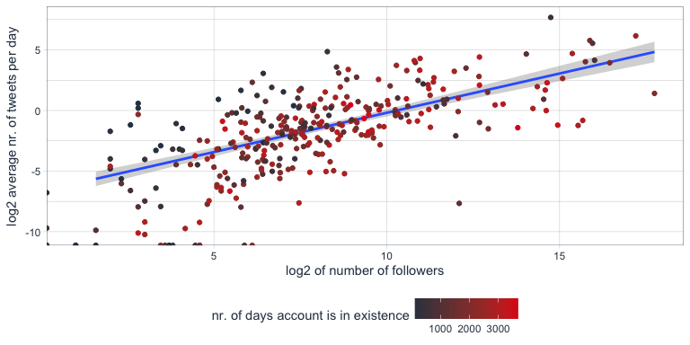

<br>

### Tidy text analysis

Next, I want to know more about my followers by analysing their Twitter descriptions with the **tidytext** package.

``` r
library(tidytext)
library(SnowballC)
```

Let's first assign a unique id to each user:

``` r
followers_df <- followers_df %>%
  mutate(id = seq_along(1:n()))
```

To prepare the data, I am going to unnest the words in the user descriptions, convert them to the word stem, remove stop words and urls.

``` r
data(stop_words)

tidy_descr <- followers_df %>%
  unnest_tokens(word, description) %>%
  mutate(word_stem = wordStem(word)) %>%
  anti_join(stop_words, by = "word") %>%
  filter(!grepl("\\.|http", word))

save(tidy_descr, file = "my_tidy_descr.RData")
```

``` r
load("my_tidy_descr.RData")
```

<br>

#### What are the most commonly used words in my followers' descriptions?

``` r
tidy_descr %>%
  count(word_stem, sort = TRUE) %>%
  filter(n > 20) %>%
  ggplot(aes(x = reorder(word_stem, n), y = n)) +
    geom_col(color = palette_light()[1], fill = palette_light()[1], alpha = 0.8) +
    coord_flip() +
    theme_tq() +
    labs(x = "",
         y = "count of word stem in all followers' descriptions")
```

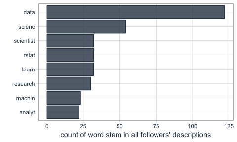

<br>

This, we can also show with a word cloud.

``` r
library(wordcloud)
library(tm)
```

``` r
tidy_descr %>%
  count(word_stem) %>%
  mutate(word_stem = removeNumbers(word_stem)) %>%
  with(wordcloud(word_stem, n, max.words = 100, colors = palette_light()))
```


<br>

Instead of looking for the most common words, we can also look for the most common ngrams: here, for the most common word pairs (bigrams) in my followers' descriptions.

``` r
tidy_descr_ngrams <- followers_df %>%
  unnest_tokens(bigram, description, token = "ngrams", n = 2) %>%
  filter(!grepl("\\.|http", bigram)) %>%
  separate(bigram, c("word1", "word2"), sep = " ") %>%
  filter(!word1 %in% stop_words$word) %>%
  filter(!word2 %in% stop_words$word)

bigram_counts <- tidy_descr_ngrams %>%
  count(word1, word2, sort = TRUE)
save(bigram_counts, file = "bigram_counts.RData")
```

``` r
load("bigram_counts.RData")
```

``` r
bigram_counts %>%
  filter(n > 10) %>%
  ggplot(aes(x = reorder(word1, -n), y = reorder(word2, -n), fill = n)) +
    geom_tile(alpha = 0.8, color = "white") +
    scale_fill_gradientn(colours = c(palette_light()[[1]], palette_light()[[2]])) +
    coord_flip() +
    theme_tq() +
    theme(legend.position = "right") +
    theme(axis.text.x = element_text(angle = 45, vjust = 1, hjust = 1)) +
    labs(x = "first word in pair",
         y = "second word in pair",
         fill = "count")
```

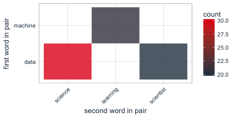

<br>

These, we can also show as a graph:

``` r
library(igraph)
library(ggraph)
```

``` r
bigram_graph <- bigram_counts %>%
  filter(n > 5) %>%
  graph_from_data_frame()

set.seed(1)

a <- grid::arrow(type = "closed", length = unit(.15, "inches"))
```

``` r
ggraph(bigram_graph, layout = "fr") +
  geom_edge_link(aes(edge_alpha = n), show.legend = FALSE,
                 arrow = a, end_cap = circle(.07, 'inches')) +
  geom_node_point(color =  palette_light()[1], size = 5, alpha = 0.8) +
  geom_node_text(aes(label = name), vjust = 1.5, hjust = 0.5) +
  theme_void()
```

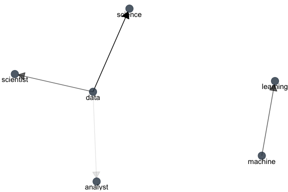

<br>

We can also use bigram analysis to identify negated meanings (this will become relevant for sentiment analysis later). So, let's look at which words are preceded by "not" or "no".

``` r
bigrams_separated <- followers_df %>%
  unnest_tokens(bigram, description, token = "ngrams", n = 2) %>%
  filter(!grepl("\\.|http", bigram)) %>%
  separate(bigram, c("word1", "word2"), sep = " ") %>%
  filter(word1 == "not" | word1 == "no") %>%
  filter(!word2 %in% stop_words$word)

not_words <- bigrams_separated %>%
  filter(word1 == "not") %>%
  inner_join(get_sentiments("afinn"), by = c(word2 = "word")) %>%
  count(word2, score, sort = TRUE) %>%
  ungroup()
```

``` r
not_words %>%
  mutate(contribution = n * score) %>%
  arrange(desc(abs(contribution))) %>%
  head(20) %>%
  mutate(word2 = reorder(word2, contribution)) %>%
  ggplot(aes(word2, n * score, fill = n * score > 0)) +
    geom_col(show.legend = FALSE) +
    scale_fill_manual(values = palette_light()) +
    labs(x = "",
         y = "Sentiment score * number of occurrences",
         title = "Words preceded by \"not\"") +
    coord_flip() +
    theme_tq()
```

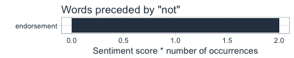

<br>

#### What's the predominant sentiment in my followers' descriptions?

For sentiment analysis, I will exclude the words with a negated meaning from nrc and switch their postive and negative meanings from bing (although in this case, there was only one negated word, "endorsement", so it won't make a real difference).

``` r
tidy_descr_sentiment <- tidy_descr %>%
  left_join(select(bigrams_separated, word1, word2), by = c("word" = "word2")) %>%
  inner_join(get_sentiments("nrc"), by = "word") %>%
  inner_join(get_sentiments("bing"), by = "word") %>%
  rename(nrc = sentiment.x, bing = sentiment.y) %>%
  mutate(nrc = ifelse(!is.na(word1), NA, nrc),
         bing = ifelse(!is.na(word1) & bing == "positive", "negative", 
                       ifelse(!is.na(word1) & bing == "negative", "positive", bing)))
```

``` r
tidy_descr_sentiment %>%
  filter(nrc != "positive") %>%
  filter(nrc != "negative") %>%
  gather(x, y, nrc, bing) %>%
  count(x, y, sort = TRUE) %>%
  filter(n > 10) %>%
  ggplot(aes(x = reorder(y, n), y = n)) +
    facet_wrap(~ x, scales = "free") +
    geom_col(color = palette_light()[1], fill = palette_light()[1], alpha = 0.8) +
    coord_flip() +
    theme_tq() +
    labs(x = "",
         y = "count of sentiment in followers' descriptions")
```

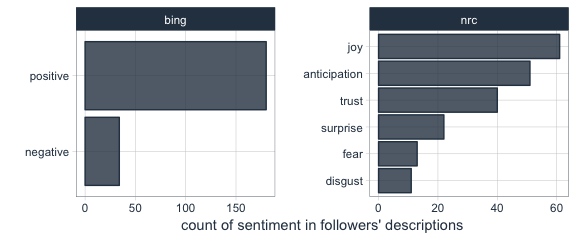

<br>

Are followers' descriptions mostly positive or negative?

The majority of my followers have predominantly positive descriptions.

``` r
tidy_descr_sentiment %>%
  count(screenName, word, bing) %>%
  group_by(screenName, bing) %>%
  summarise(sum = sum(n)) %>%
  spread(bing, sum, fill = 0) %>%
  mutate(sentiment = positive - negative) %>%
  ggplot(aes(x = sentiment)) +
    geom_density(color = palette_light()[1], fill = palette_light()[1], alpha = 0.8) +
    theme_tq()
```

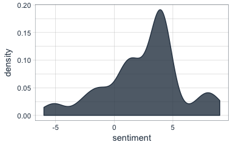

<br>

What are the most common positive and negative words in followers' descriptions?

``` r
library(reshape2)
tidy_descr_sentiment %>%
  count(word, bing, sort = TRUE) %>%
  acast(word ~ bing, value.var = "n", fill = 0) %>%
  comparison.cloud(colors = palette_light()[1:2],
                   max.words = 100)
```


<br>

#### Topic modeling: are there groups of followers with specific interests?

``` r
library(topicmodels)
```

``` r
dtm_words_count <- tidy_descr %>%
  mutate(word_stem = removeNumbers(word_stem)) %>%
  count(screenName, word_stem, sort = TRUE) %>%
  ungroup() %>%
  filter(word_stem != "") %>%
  cast_dtm(screenName, word_stem, n)

# set a seed so that the output of the model is predictable
dtm_lda <- LDA(dtm_words_count, k = 5, control = list(seed = 1234))

topics_beta <- tidy(dtm_lda, matrix = "beta")
save(topics_beta, file = "topics_beta.RData")
```

``` r
load("topics_beta.RData")
```

``` r
p1 <- topics_beta %>%
  filter(grepl("[a-z]+", term)) %>%
  group_by(topic) %>%
  top_n(10, beta) %>%
  ungroup() %>%
  arrange(topic, -beta) %>%
  mutate(term = reorder(term, beta)) %>%
  ggplot(aes(term, beta, color = factor(topic), fill = factor(topic))) +
    geom_col(show.legend = FALSE, alpha = 0.8) +
    scale_color_manual(values = palette_light()) +
    scale_fill_manual(values = palette_light()) +
    facet_wrap(~ topic, ncol = 5) +
    coord_flip() +
    theme_tq() +
    labs(x = "",
         y = "beta (~ occurrence in topics 1-5)",
         title = "The top 10 most characteristic words describe topic categories.")
```

``` r
topics_gamma <- tidy(dtm_lda, matrix = "gamma") %>%
  arrange(desc(gamma))
save(topics_gamma, file = "topics_gamma.RData")
```

``` r
load("topics_gamma.RData")
```

``` r
user_topic <- topics_gamma %>%
  group_by(document) %>%
  top_n(1, gamma)
```

``` r
p2 <- user_topic %>%
  #filter(gamma > 0.25) %>%
  group_by(topic) %>%
  top_n(10, gamma) %>%
  ggplot(aes(x = reorder(document, -gamma), y = gamma, color = factor(topic))) +
    facet_wrap(~ topic, scales = "free", ncol = 5) +
    geom_point(show.legend = FALSE, size = 4, alpha = 0.8) +
    scale_color_manual(values = palette_light()) +
    scale_fill_manual(values = palette_light()) +
    theme_tq() +
    coord_flip() +
    labs(x = "",
         y = "gamma\n(~ affiliation with topics 1-5)")
```

``` r
library(grid)
library(gridExtra)
grid.arrange(p1, p2, ncol = 1, heights = c(0.7, 0.3))
```

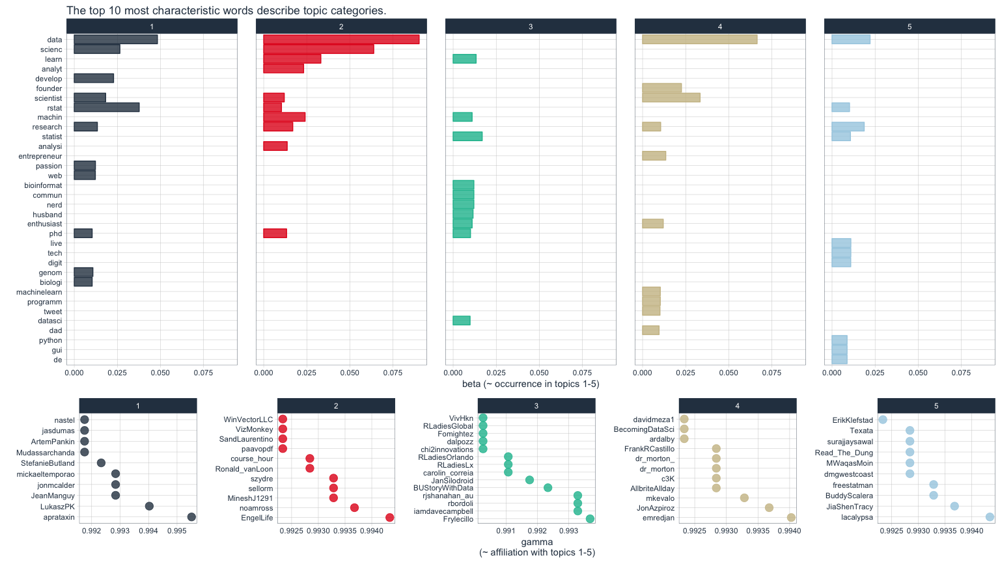

------------------------------------------------------------------------

<br>

``` r
sessionInfo()
```

    ## R version 3.4.0 (2017-04-21)
    ## Platform: x86_64-apple-darwin15.6.0 (64-bit)
    ## Running under: macOS Sierra 10.12.5
    ## 
    ## Matrix products: default
    ## BLAS: /Library/Frameworks/R.framework/Versions/3.4/Resources/lib/libRblas.0.dylib
    ## LAPACK: /Library/Frameworks/R.framework/Versions/3.4/Resources/lib/libRlapack.dylib
    ## 
    ## locale:
    ## [1] en_US.UTF-8/en_US.UTF-8/en_US.UTF-8/C/en_US.UTF-8/en_US.UTF-8
    ## 
    ## attached base packages:
    ## [1] grid      stats     graphics  grDevices utils     datasets  methods  
    ## [8] base     
    ## 
    ## other attached packages:
    ##  [1] gridExtra_2.2.1               topicmodels_0.2-6            
    ##  [3] reshape2_1.4.2                ggraph_1.0.0                 
    ##  [5] igraph_1.0.1                  tm_0.7-1                     
    ##  [7] NLP_0.1-10                    wordcloud_2.5                
    ##  [9] RColorBrewer_1.1-2            SnowballC_0.5.1              
    ## [11] tidytext_0.1.3                bindrcpp_0.2                 
    ## [13] tidyquant_0.5.1               quantmod_0.4-10              
    ## [15] TTR_0.23-1                    PerformanceAnalytics_1.4.3541
    ## [17] xts_0.9-7                     zoo_1.8-0                    
    ## [19] lubridate_1.6.0               dplyr_0.7.0                  
    ## [21] purrr_0.2.2.2                 readr_1.1.1                  
    ## [23] tidyr_0.6.3                   tibble_1.3.3                 
    ## [25] ggplot2_2.2.1                 tidyverse_1.1.1              
    ## [27] twitteR_1.1.9                
    ## 
    ## loaded via a namespace (and not attached):
    ##  [1] viridis_0.4.0     httr_1.2.1        viridisLite_0.2.0
    ##  [4] bit64_0.9-7       jsonlite_1.5      modelr_0.1.0     
    ##  [7] assertthat_0.2.0  stats4_3.4.0      cellranger_1.1.0 
    ## [10] ggrepel_0.6.5     yaml_2.1.14       slam_0.1-40      
    ## [13] backports_1.1.0   lattice_0.20-35   glue_1.1.0       
    ## [16] digest_0.6.12     rvest_0.3.2       colorspace_1.3-2 
    ## [19] htmltools_0.3.6   Matrix_1.2-10     plyr_1.8.4       
    ## [22] psych_1.7.5       pkgconfig_2.0.1   broom_0.4.2      
    ## [25] haven_1.0.0       scales_0.4.1      tweenr_0.1.5     
    ## [28] ggforce_0.1.1     lazyeval_0.2.0    mnormt_1.5-5     
    ## [31] magrittr_1.5      readxl_1.0.0      evaluate_0.10    
    ## [34] tokenizers_0.1.4  janeaustenr_0.1.5 nlme_3.1-131     
    ## [37] MASS_7.3-47       forcats_0.2.0     xml2_1.1.1       
    ## [40] foreign_0.8-68    tools_3.4.0       hms_0.3          
    ## [43] stringr_1.2.0     munsell_0.4.3     compiler_3.4.0   
    ## [46] rlang_0.1.1       units_0.4-5       rjson_0.2.15     
    ## [49] labeling_0.3      rmarkdown_1.6     gtable_0.2.0     
    ## [52] DBI_0.7           R6_2.2.2          knitr_1.16       
    ## [55] udunits2_0.13     bit_1.1-12        bindr_0.1        
    ## [58] rprojroot_1.2     Quandl_2.8.0      modeltools_0.2-21
    ## [61] stringi_1.1.5     parallel_3.4.0    Rcpp_0.12.11
